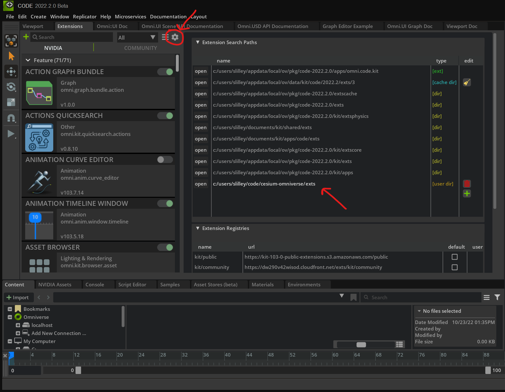
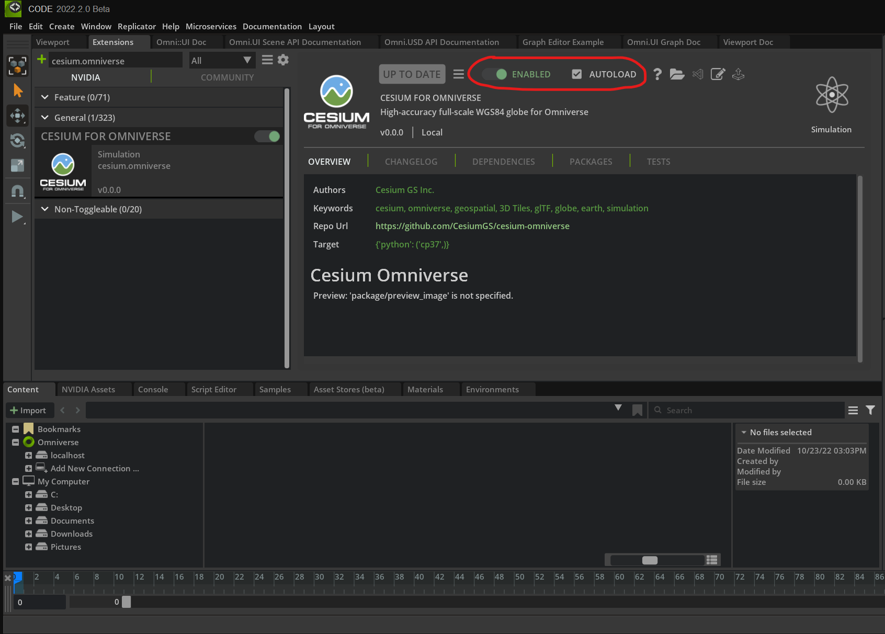
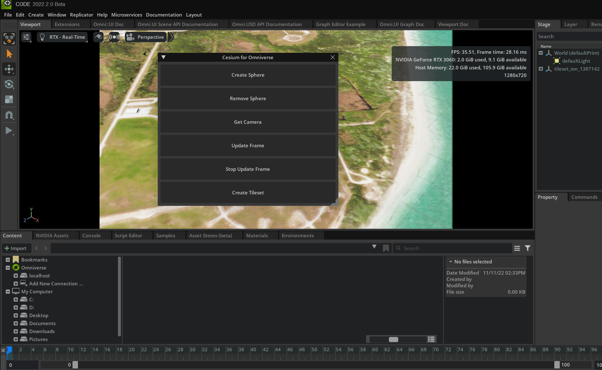

# Cesium for Omniverse

## Prerequisites

- Install Nvidia Omniverse: https://www.nvidia.com/en-us/omniverse/download/
- Install Omniverse Code 2022.3.0 (or later)

## Building

- Build the C++ library. See [Building](./docs/building/building.md) for details.

    ```sh
    # Windows
    cmake -B build
    cmake --build build --config Release
    cmake --install build --config Release
    ```
    ```sh
    # Linux
    cmake -B build -D CMAKE_BUILD_TYPE=Release
    cmake --build build
    cmake --install build
    ```

## Running

- Launch Omniverse Code. Add `exts` to the extension search paths so it can find our extensions. Then look for "cesium.omniverse" in the extension manager and enable it. Click the auto-load checkbox to load our extension on startup.
  Extension Search Paths | Enable Extension
  --|--
  |

- You should see a UI window appear. Click `Create Tileset` and then `Update Frame`

  
