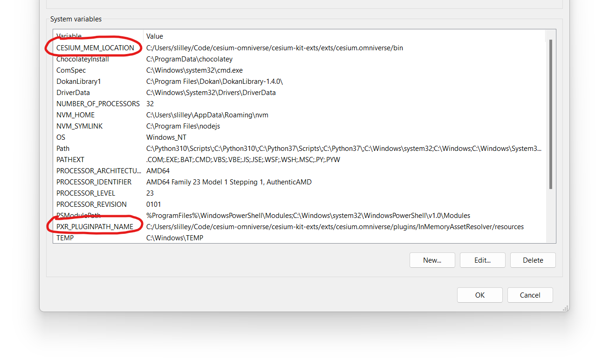
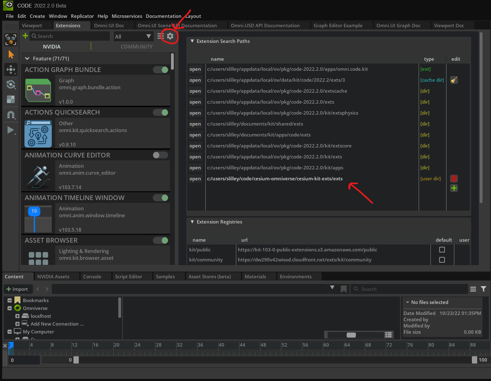
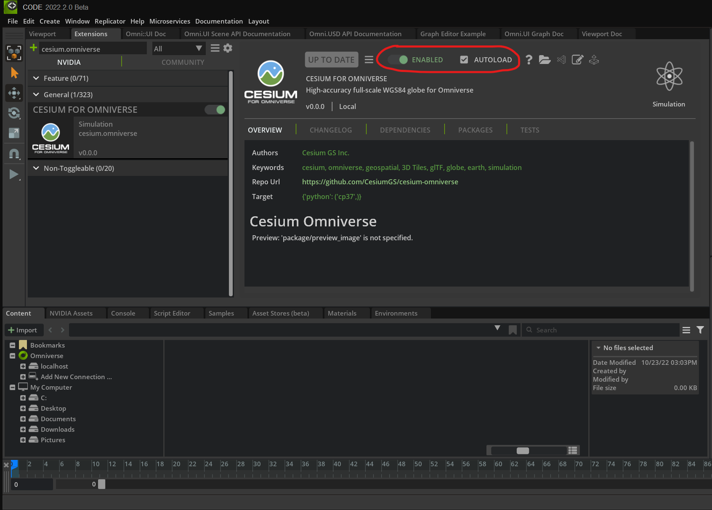
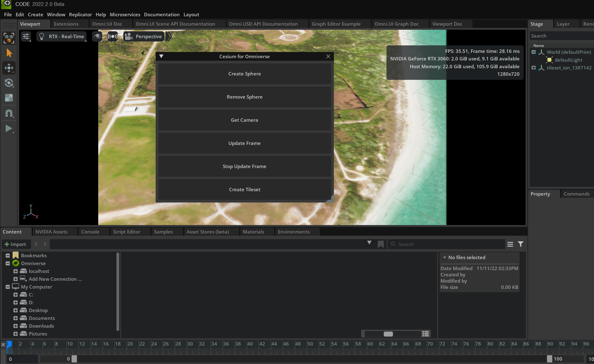

# Cesium Kit Extensions

## Prerequisites

- Install Nvidia Omniverse: https://www.nvidia.com/en-us/omniverse/download/
- Install Omniverse Code
- Go to the [`cesium-omniverse`](../cesium-omniverse/) directory and build the C++ project

    ```sh
    # Windows
    cmake -B build
    cmake --build build --config Release
    cmake --install build --config Release --component kit
    ```
    ```sh
    # Linux
    cmake -B build -D CMAKE_BUILD_TYPE=Release
    cmake --build build
    cmake --install build --component kit
    ```

- Add the following system environment variables so that Omniverse finds our `InMemoryAssetResolver` plugin (change `path/to/` to the actual path on your system)

  Environment Variable|Value
  --|--
  `CESIUM_MEM_LOCATION`|`path/to/cesium-omniverse/cesium-kit-exts/exts/cesium.omniverse/bin`
  `PXR_PLUGINPATH_NAME`|`path/to/cesium-omniverse/cesium-kit-exts/exts/cesium.omniverse/plugins/InMemoryAssetResolver/resources`

  On Windows it should look something like:



  > **Important:** After setting the environment variables you need to close out of Omniverse Launcher and Omniverse Code (make sure Omniverse Launcher is closed in the system tray as well). This ensures that the enviroment variables are picked up when you relaunch Omniverse Code.

- Launch Omniverse Code. Add `exts` to the extension search paths so it can find our extensions. Then look for "cesium.omniverse" in the extension manager and enable it. Click the auto-load checkbox to load our extension on startup.
  Extension Search Paths | Enable Extension
  --|--
  |

- You should see a UI window appear. Click `Create Tileset` and then `Update Frame`

  


## VS Code development

- Run `link_app`. This will create a folder called `app` that is a symlink to the Omniverse Code installation folder. This allows VS Code Python IntelliSense to find the Omniverse Python libraries and select the same Python interpreter as Omniverse Code.
    ```sh
    # Windows
    link_app.bat --app code
    ```
    ```sh
    # Linux
    link_app.sh --app code
    ```
- Open the VS Code workspace for your OS and install the recommended extensions. Make sure to open the workspace instead of opening the `cesium-kit-exts` folder directly, otherwise IntelliSense my not work properly.
  - [cesium-omniverse-linux.code-workspace](./.vscode/cesium-omniverse-linux.code-workspace)
  - [cesium-omniverse-windows.code-workspace](./.vscode/cesium-omniverse-windows.code-workspace)
