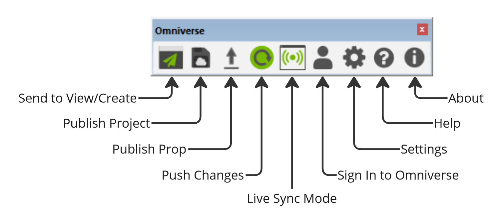
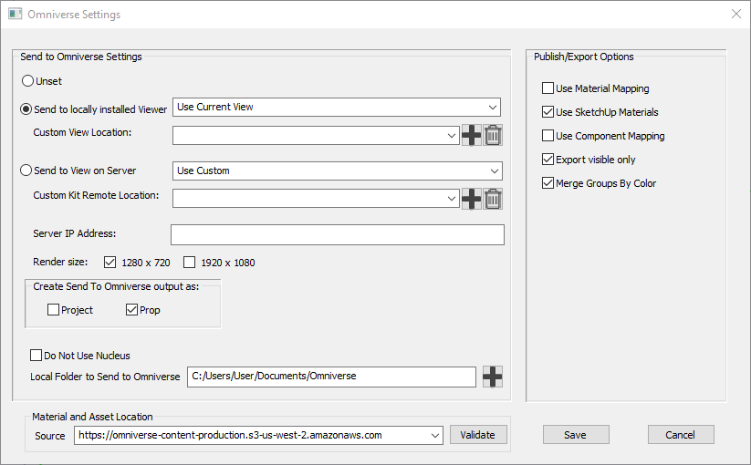
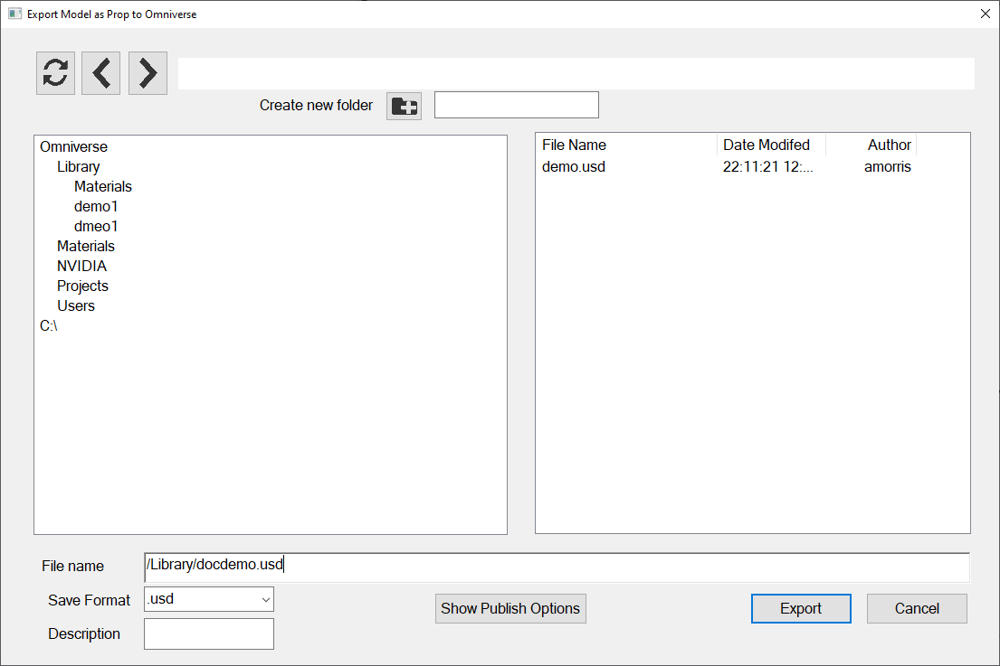
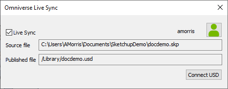

Omniverse Connector & Live Sync for SketchUp
============================================
:toc:
:toclevels: 2

:official-connector-doc: https://docs.omniverse.nvidia.com/con_connect/con_connect/sketchup.html

== Introduction

This documentation is designed as a supplement guide for the {official-connector-doc}[official Nvidia documentation on the SketchUp Connector] for Omniverse. While there are some intersections, the primary goal of this documentation is to get someone new to SketchUp, Omniverse, and Cesium for Omniverse up and running quickly. It is strongly advised that the reader take the time to {official-connector-doc}[review the entire official documentation fully].

== Installing Omniverse Connector for SketchUp

Installing the connector can be done through the Exchange Tab in the Omniverse Launcher. The connector requires a SketchUp Pro license. More details can be found in the https://docs.omniverse.nvidia.com/con_connect/con_connect/sketchup.html#installing-the-connector[Installing the Connector] section of the official docs.

=== Instructions

. Ensure that SketchUp is closed.
. Navigate to the Exchange Tab
. Search for "SketchUp"
. Click on "Trimble SketchUp Omniverse Connector"
. Click Install

// TODO: Demonstration video.

== Using Omniverse Connector for SketchUp

NOTE: The https://docs.omniverse.nvidia.com/con_connect/con_connect/sketchup.html#connecting-to-view-local[official documentation] has a section on connecting locally to Omniverse for editing. This section in the official guide is slightly out of date and does not contain details about working with Nucleus at the time of writing, but is worth a read before continuing further.

=== The Omniverse Toolbar

Once installed and in a project, the Omniverse Toolbar can be dragged to the toolbar area. The diagram below describes all of the functions.

=== Configuring SketchUp for Omniverse with Nucleus

Once you have started a new project with the correct scale for your needs, you will need to ensure that the settings are properly configured for your Nucleus server. The "Do Not Use Nucleus" checkbox *must be unchecked* for Live Editing with Nucleus to work.

WARNING: Every time you start or open a new project you must go into the settings dialog and uncheck "Do Not Use Nucleus" at the time of this writing. It is unclear if this is intended or a bug.

It is also recommended that 'Send to locally installed Viewer' is configured to use either the latest View or Create, and 'Create Send To Omniverse output as:'' has "Prop" selected. All other settings can be set to the user's liking.

=== Signing into Omniverse

Click the 'Sign In to Omniverse' button and enter in the host name for your Nucleus server. This will open your browser to finish the sign in process.

=== Exporting to Nucleus

Once configured correctly, you can export to Nucleus by using either the 'Publish Project' or 'Publish Prop' button. 'Publish Project' produces a `*.project.usd` file and associated directory and 'Publish Prop' produces a single `*.usd` file containing the relevant information.

NOTE: As publishing a prop is more relevant to our needs, this section only goes into further details about 'Publish Prop'. Publishing a project is more or less identical steps.

When the user presses the 'Publish Prop' button in order to publish a new prop, a dialog appears similar to the one below. The flow for saving to Nucleus is:

. Ensure your SketchUp project is saved.
. Select the path you want to use in Omniverse Nucleus
. Enter the name of the file after the path in the 'File Name' field. (Extension not required.)
. Click 'Export'

In this screenshot, we are saving a file named "docdemo.usd" to the Library folder within Nucleus.

NOTE: The 'Show Publish Options' button is a quick way to open the settings dialog if you forget to open settings and uncheck 'Do Not Use Nucleus' checkbox when you opened or started your project.

If you are resuming work on a prop and want to properly link to Nucleus so it recieves your latest edits, simply follow the same instructions but choose the file you want in the picker. This will create a new session with Omniverse so you can continue syncing your SketchUp file with Nucleus. Failure to do so when you reopen your file will result in Nucleus not receiving the changes.

=== Live Editing

Live editing with the SketchUp Connector does work however it appears to be unidirectional in the direction of Omniverse. In order to enable Live Editing, click the 'Live Sync Mode' button in the middle of the Omniverse Toolbar. This will open a dialog:

Once the dialog is open, ensure that the 'Live Sync' checkbox is checked and Live Editing will be enabled. Once you make changes they will be automatically shared with Omniverse.

WARNING: Do not close the Omniverse Live Sync dialog box or click the 'Connect USD' button. Doing so will both clear the link you currently have with Nucleus for the file, and will end the Live Sync session. We have confirmed with Nvidia that this is intended behavior.

== References

* {official-connector-doc}[Official Nvidia Omniverse Documentation]
